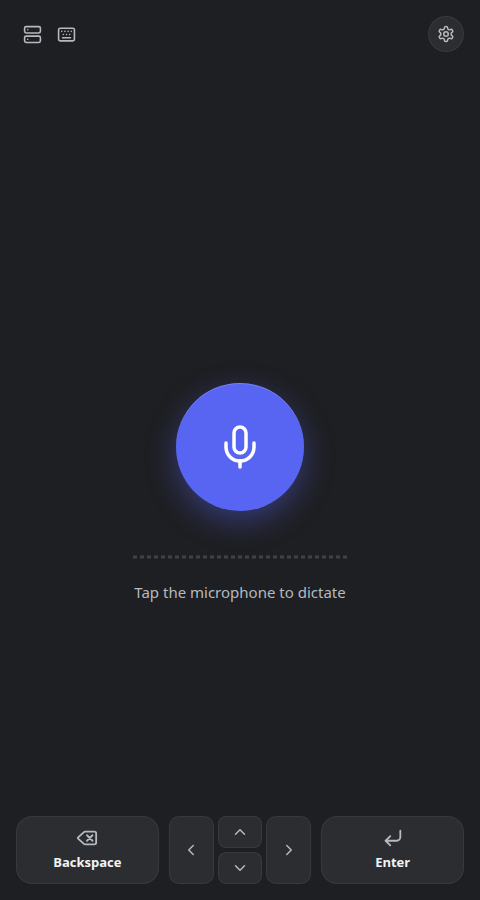

# Voice Keyboard

Self-hosted speech-to-text keyboard. Dictate in the browser, and the text is
typed into the focused window on your computer. Transcription runs on your own
GPU with Whisper.

## 1. Run the server

Requirements: Docker with Compose v2. An NVIDIA GPU (with the NVIDIA Container
Toolkit) is used if present; otherwise Whisper runs on the CPU, more slowly.

```bash
./setup.sh
```

On the first run `setup.sh`:

- creates `.env`, the one settings file (documented in `.env.example`), with a
  random admin password and session secret,
- picks `gpu` or `cpu`, fills in this machine's names and IP address for the
  HTTPS certificate, and chooses free ports (HTTPS 443, else 8272; HTTP 80, else 8271),
- starts everything with `docker compose up -d --build`, waits until it is
  ready, and prints the address, the admin password, and how to trust the
  certificate on your devices.

Run it again at any time to redeploy; existing settings are kept.
The first start downloads the Whisper model, which takes a few minutes.

**Without `setup.sh`:**

```bash
cp .env.example .env
# edit .env: at least WEB_PASSWORD, SESSION_SECRET, VK_DOMAIN and COMPOSE_PROFILES
#   (openssl rand -hex 32 makes a good SESSION_SECRET)
docker compose up -d --build        # also after every change to .env
docker compose logs -f transcription   # wait for "Application startup complete"
```

Every setting is described in [Configuration](#configuration) below and in
`.env.example`. Updating: `git pull && docker compose up -d --build`.

To have speech in any language typed as English, set `WHISPER_VARIANT=translate`
in `.env` (uses Whisper large-v3). In the normal mode, pick your language in
Settings (100 languages; English by default). **Hinglish** types Hindi in English
letters ("kya aap meri madad kar sakte hain"), and with English selected any
word Whisper writes in an Indian script is typed in English letters too. To switch between GPU and CPU, set
`COMPOSE_PROFILES=gpu` or `cpu` in `.env` and run `docker compose down` first.

## 2. HTTPS and the microphone

Browsers only allow the microphone over HTTPS with a certificate they trust.
Voice Keyboard handles this for you:

- A bundled Caddy proxy serves the web UI over **HTTPS** (`HTTPS_PORT`) and
  redirects plain HTTP (`HTTP_PORT`) to it. `VK_PROTOCOL=both` also serves the app
  over plain HTTP, for example for a Cloudflare tunnel; `VK_PROTOCOL=http` serves
  it only over plain HTTP, behind a proxy that adds HTTPS.
- **Certificates are automatic.** On a local network, Caddy signs them with its
  own certificate authority, and you trust that authority once per device
  (one command; `setup.sh` prints it). For a public domain with port 443 open,
  it uses Let's Encrypt and no device setup is needed.
- Every name or IP address people use to reach the server must be listed in
  `VK_DOMAIN` in `.env`.

**[docs/https.md](docs/https.md)** is the full guide:
- local network only;
- a public domain (Let's Encrypt);
- Cloudflare Tunnel;
- port forwarding (router, VPS, DuckDNS);
- behind an existing reverse proxy (Traefik, nginx);
- changing names and ports;
- troubleshooting (`ERR_SSL_PROTOCOL_ERROR`, "Not secure", `ERR_TOO_MANY_REDIRECTS`).

### Several addresses: local network and Cloudflare

A server is often reachable two ways: directly on the local network (fast) and
through a Cloudflare tunnel or public name (from anywhere). List every address
in `VK_URLS`, for example
`VK_URLS=https://192.168.1.20:8272,https://voice.example.com`. Then:

- **Clients** (desktop and ESP32) learn every address when they connect,
  whichever one they were installed with, and keep the list. Each connection
  goes to a local address if one answers (the fastest), otherwise to a public
  one. The public address is the last resort. While connected publicly they
  re-check the local addresses every ~15 seconds and move back to the LAN as
  soon as it answers; away from home they fall back to the public address on
  their own. Before switching, a client checks that the address leads to the
  same server (`/api/instance`), and it verifies the local certificate with
  the server's own CA, which the server sends over the already-verified
  connection. Nothing needs to be installed on the client for this.
- **The web UI** opened on a public address checks, in the background, whether
  a local address of the same server answers, and moves there (**Settings →
  Fastest address**, on by default; it waits until the page is idle).
  **Settings** shows the address you are on and the others, with their
  response time and an **Open** link. The browser must trust the local
  certificate for this, like any page on the local address: trust the local
  CA on that device (see [docs/https.md](docs/https.md), scenario 1; Settings
  links to it when a local address is not reachable). Sign-in is per address,
  so sign in once on the local address too.

Local addresses are private IPs (`192.168.x.x`, `10.x.x.x`, `172.16–31.x.x`),
`.local` names and single-word host names. Every name in `VK_URLS` must also be
in `VK_DOMAIN`, so the server has a certificate for it.

## 3. Open the web UI

Go to the address `setup.sh` printed (for example `https://192.168.1.20/`) and
sign in as `admin`.



If the server becomes unreachable during dictation, the page keeps recording
and reconnects on its own.

## 4. Install the desktop client

In the web UI open **Settings → Clients**, pick the operating system, and run
the command it shows on the computer you want to type on:

```bash
# macOS / Linux
curl -fsSL https://your-host/client/install.sh | sh -s -- --server https://your-host --token …
```
```powershell
# Windows (PowerShell)
& ([scriptblock]::Create((irm 'https://your-host/client/install.ps1'))) -Server 'https://your-host' -Token '…'
```

It installs one self-contained program (x86-64 or ARM64) that runs in the
background, starts after every restart, and reconnects on its own. Every
installed client is listed under **Settings → Clients** with its status. Tap
the one that should type; only that active client receives your dictation.

```bash
vkeyboard status   # connected? selected to type?  Also: logs, stop, start, uninstall
```

On macOS, allow it under **Privacy & Security → Accessibility** when prompted.
Details are in [clients/desktop/README.md](clients/desktop/README.md).

## 5. Or use an ESP32 board as a Bluetooth keyboard

An ESP32 or ESP32-C3 board can be a client too. It joins your Wi-Fi, receives
your dictation from this server, and types it into whatever computer, tablet or
phone it is paired with over Bluetooth. Nothing is installed on that device.

Plug the board into the computer where your browser runs, and open
**Settings → Clients → Add an ESP32 board** (the `/esp32` page) in Chrome or
Edge. Enter the Wi-Fi network and password, and a name. The page installs the
firmware over USB, writes the settings to the board, and shows when it has
joined Wi-Fi and connected to this server. Then pair **that name** in the
target device's Bluetooth settings. The same page updates the firmware or
changes the settings later, without removing the pairing.

It types what a US keyboard layout can type: accented Latin letters become
plain ones (é → e), and other scripts are skipped. The firmware is in
[clients/esp32/](clients/esp32/README.md), and `tools/release.sh` publishes it with the desktop
client.

## Configuration

All settings live in `.env` (copy `.env.example`; `setup.sh` creates it). Run
`docker compose up -d --build` after changing it. Only the two marked
*required* have no usable default.

| Variable | Default | What it does | Example |
|---|---|---|---|
| **Deployment** ||||
| `COMPOSE_PROFILES` | — | Where Whisper runs: `gpu` (NVIDIA GPU with the Container Toolkit) or `cpu`. Run `docker compose down` before switching. | `gpu` |
| **Accounts** ||||
| `ADMIN_USERNAME` | `admin` | Username of the first account, created when the database is empty. | `admin` |
| `WEB_PASSWORD` | *required* | Password of that first account. Only read on the first start; change it later in Settings → Account. | `a-long-password` |
| `SESSION_SECRET` | *required* | Signs login sessions and identifies the deployment to clients. Keep it stable: changing it signs everyone out. | output of `openssl rand -hex 32` |
| `ALLOW_SIGNUPS` | `false` | Lets people create their own accounts on the login page. | `true` |
| `API_KEY` | — | Optional key for scripts (`Authorization: Bearer …`), acting as the admin account. | `change-me` |
| **Whisper** ||||
| `WHISPER_VARIANT` | `transcribe` | `transcribe` types what you say (large-v3-turbo); `translate` types the English translation of any language (large-v3, ~1 GB more GPU memory). | `translate` |
| `WHISPER_LANGUAGE` | `en` | Language the web UI starts with; users can change it. Empty = detect. | `hi` |
| `WHISPER_MODEL` | from the variant | Overrides the model. | `deepdml/faster-whisper-large-v3-turbo-ct2` |
| `WHISPER_COMPUTE_TYPE` | `int8_float16` (GPU), `int8` (CPU) | Precision; `float16` is marginally more accurate. | `float16` |
| `WHISPER_CONCURRENCY` | `1` | Transcriptions run at once; more wait their turn. | `2` |
| `WHISPER_BEAM_SIZE` | `5` | Beam search width; `1` is slightly faster and less accurate. | `5` |
| `WHISPER_TEMPERATURE_FALLBACK` | `true` | Retries repetitive output with more randomness. | `true` |
| **HTTPS, names and ports** ([docs/https.md](docs/https.md)) ||||
| `VK_PROTOCOL` | `https` | `https`: the app on `HTTPS_PORT`, `HTTP_PORT` redirects. `http`: plain HTTP only, behind a proxy or tunnel that adds HTTPS. `both`: HTTPS on `HTTPS_PORT` and plain HTTP on `HTTP_PORT` (LAN + Cloudflare tunnel). | `both` |
| `VK_DOMAIN` | `localhost` | Every name or IP people and clients use to reach the server, comma-separated. Caddy issues certificates for these. | `192.168.1.20, voice.local, voice.example.com` |
| `VK_URLS` | — | Every full address of the server, comma-separated: clients use the fastest reachable one, local first, and the web UI moves to a local one ([above](#several-addresses-local-network-and-cloudflare)). Without it, clients stay on the address they were installed with. | `https://192.168.1.20:8272,https://voice.example.com` |
| `VK_DEFAULT_SNI` | `localhost` | Certificate for connections by IP address (they send no name). | `192.168.1.20` |
| `VK_TLS` | `internal` | `internal`: Caddy's local CA, trusted once per device. An email address: Let's Encrypt, for a public name with port 443 open. | `you@example.com` |
| `HTTPS_PORT` / `HTTP_PORT` | `443` / `80` | Ports on this machine. | `8272` / `8271` |
| `HTTPS_BIND` / `HTTP_BIND` | `0.0.0.0` | Interface for each port; `127.0.0.1` keeps it off the network. | `127.0.0.1` |
| **Clients** ||||
| `GITHUB_REPO` | — | GitHub repository whose newest `v*` release the server mirrors and serves at `/client` (desktop builds and ESP32 firmware). | `owner/voice-keyboard` |
| `GITHUB_TOKEN` | — | Token that can read a private repository's releases. | `github_pat_…` |
| `RELEASE_SYNC_SECONDS` | `3600` | How often the release is checked. | `600` |
| `AUTO_UPDATE` | `true` | Desktop clients update themselves to the mirrored release (the Update button in Settings → Clients works either way). | `false` |

An example for a home server reached on the LAN and through a Cloudflare tunnel:

```bash
COMPOSE_PROFILES=gpu
WEB_PASSWORD=…                      # setup.sh generates it
SESSION_SECRET=…                    # openssl rand -hex 32
VK_PROTOCOL=both                    # HTTPS for the LAN, plain HTTP for the tunnel
VK_DOMAIN=192.168.1.20, voice.local, voice.example.com
VK_DEFAULT_SNI=192.168.1.20
VK_URLS=https://192.168.1.20:8272,https://voice.example.com
VK_TLS=internal
HTTPS_PORT=8272
HTTP_PORT=8271                      # the tunnel points at http://192.168.1.20:8271
GITHUB_REPO=owner/voice-keyboard
```

## Accounts

The first account (`admin`) is created from `WEB_PASSWORD`. Its username and
password can be changed later under **Settings → Account**. Set `ALLOW_SIGNUPS=true` to
let others create accounts on the login page; it is off by default. Each account
has its own clients, install command, and dictation. All accounts share the
one Whisper model: if two people dictate at the same moment, their requests
wait their turn (`WHISPER_CONCURRENCY`, default 1).

## Security

`setup.sh` generates a long random `SESSION_SECRET` and admin password. Back
up `backend/volumes`: it holds the accounts database and the local CA that
your devices trust. If an install
command leaks, click **New command** in Settings → Clients. Remove a lost
client from the same list to revoke it.
