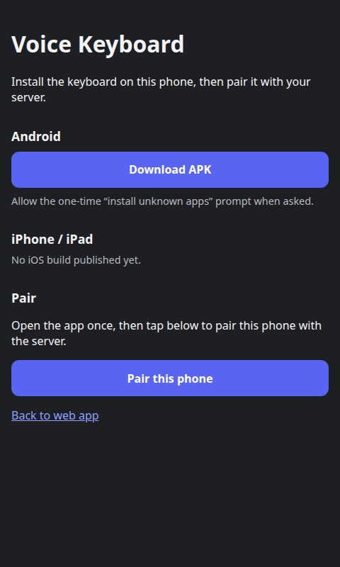

# Voice Keyboard

Self-hosted, real-time speech-to-text keyboard. Speak into your phone and the
text is typed into the active app on your computer or phone. Transcription
runs on your own GPU with Whisper; no third-party speech service is involved.

There are two ways to use this repository:

1. **Direct install** — run the backend, open one URL, install the clients.
2. **Hardware** — build the optional ESP32 Bluetooth keyboard ([esp32/](esp32/README.md)).

## 1. Direct install

Requirements: Docker Compose, an NVIDIA GPU with the NVIDIA Container Toolkit,
and HTTPS (for example a reverse proxy or Cloudflare Tunnel) if you use it
outside your LAN. Browsers only allow microphone access over HTTPS or on
`localhost`.

```bash
cp backend/.env.example backend/.env   # set WEB_PASSWORD, API_KEY, SESSION_SECRET
docker compose up -d --build
```

The first start downloads the Whisper model and can take several minutes.
Check readiness with `curl http://localhost:8271/health`.

### Web app — `/`

Open `http://localhost:8271/` (or your HTTPS URL), log in, and tap the
microphone. Text streams live; Backspace, Enter, and the arrow keys are sent to
the connected computer.


### Desktop (Windows, macOS, Linux)

In the web app open **Settings → Computers**, choose the operating system, and
copy the one-line install command (`curl … | sh` for macOS/Linux, PowerShell
for Windows). The same command works on any number of computers until you
click **New command**, which revokes it for new installs; connected computers
stay connected.
The client reconnects automatically and types into whichever window has focus:

```bash
voice-keyboard status   # also: start, stop
```

### Mobile — `/downloads`

On the phone, log in to the web app and open `https://your-host/downloads`.



1. Install the app.
   - **Android:** tap **Download APK** and allow the one-time "install unknown
     apps" prompt.
   - **iPhone/iPad:** iOS never runs unsigned apps, so install
     [SideStore](https://sidestore.io) (or AltStore) once, then tap **Install
     with SideStore**. It signs the app with your own Apple ID. With a free
     Apple ID the app must be refreshed every 7 days, which SideStore can do on
     the phone. A TestFlight link also works if you have a developer account.
2. Tap **Pair this phone**. The app opens and pairs itself with the server.
3. Enable the keyboard in system settings. On iOS, also turn on **Allow Full
   Access**.

Builds are published as GitHub Releases, not stored in git. Set `GITHUB_REPO`
and `GITHUB_TOKEN` in `backend/.env`; the server then downloads the newest
release on start-up and every hour and serves it at `/downloads`. See
[mobile/README.md](mobile/README.md).

## 2. Hardware (ESP32)

The ESP32 acts as a Bluetooth Low Energy HID keyboard, so any device that
accepts a Bluetooth keyboard can receive dictated text without installing
software. It is independent of the desktop and mobile clients. Everything —
wiring, libraries, board settings, flashing, troubleshooting — is in
[esp32/README.md](esp32/README.md).

## Repository map

| Path | Contents |
| --- | --- |
| `docker-compose.yml` | One-command backend (web UI + API on port 8271) |
| `backend/` | Dockerfile, FastAPI gateway, desktop client |
| `mobile/` | Android and iOS client notes; `releases/` for published builds |
| `esp32/` | Firmware and the web UI source shared with the backend |
| `tools/` | Build and code-generation scripts |
| `docs/` | Screenshots |

## Security

Set `WEB_PASSWORD`, `API_KEY`, and `SESSION_SECRET` before exposing the backend,
and use HTTPS/WSS outside a trusted LAN. Treat the API key and installed client
credentials as secrets, and click **New command** if an install command leaks. Whisper listens only
inside the container and is not published to the host.
